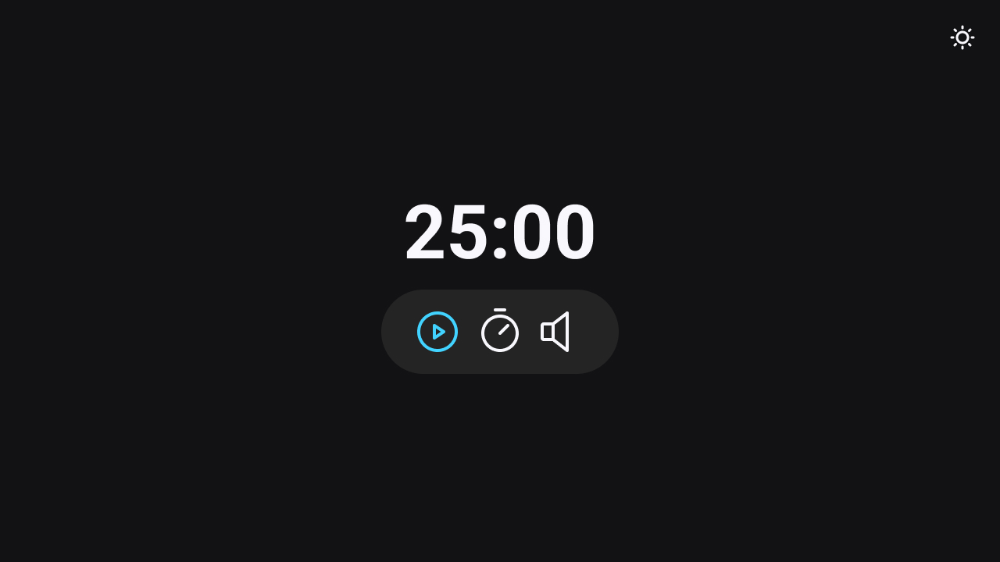

# Focus Timer - Pomodoro

## Descrição do Projeto

O "Focus Timer - Pomodoro" é um website especialmente criado para aprimorar suas sessões de estudo e aumentar a produtividade. Com a técnica Pomodoro como base, este temporizador personalizável permite que você defina o tempo de estudo de acordo com suas preferências, tornando-o perfeito para qualquer fluxo de trabalho. Com modos claro e escuro, um design minimalista e opções de música de fundo, este site foi desenvolvido para ajudar estudantes e buscadores de conhecimento a se manterem focados em suas tarefas.

## Instruções de Uso

1. Acesse o site "Focus Timer - Pomodoro" clicando [aqui](https://homermau.github.io/FocusTimer/).

2. Personalize o temporizador com o tempo desejado para suas sessões de estudo.

3. Escolha entre o modo claro ou escuro para criar o ambiente de estudo ideal.

4. Inicie a contagem regressiva para sua sessão de estudo pressionando o botão apropriado.

5. Aproveite a opção de música de fundo para manter seu foco durante o estudo.

## Contribuições

- Se você deseja contribuir para a melhoria deste projeto, sinta-se à vontade para abrir problemas (issues) e enviar solicitações de pull (pull requests). Seu feedback é valioso para nós!

## Autor

- Tiago Lucas da Silva

## Licença

Este projeto está sob a Licença MIT. Consulte o arquivo "LICENSE" para obter mais informações.

